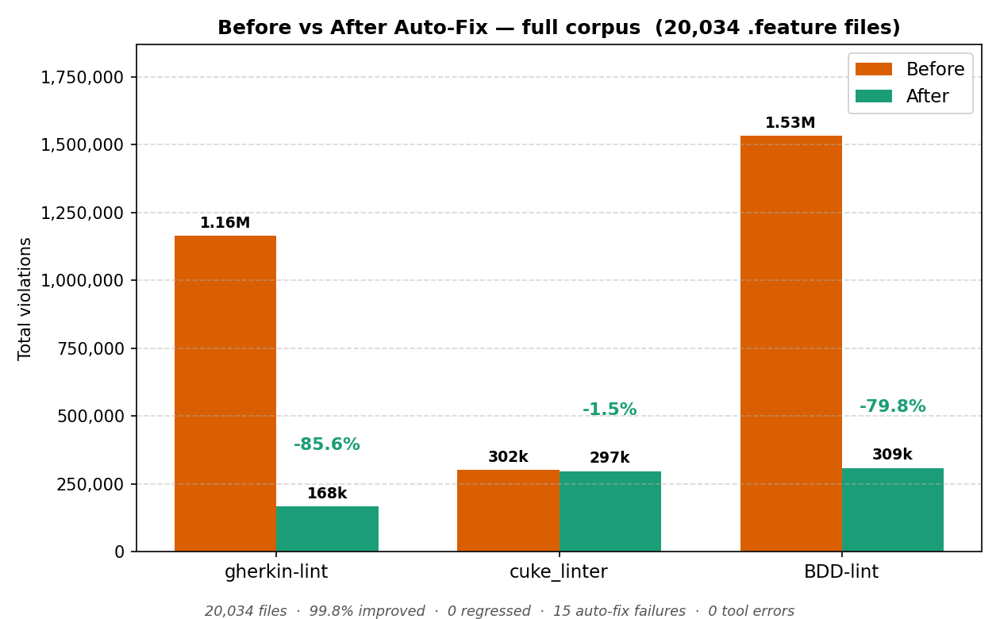
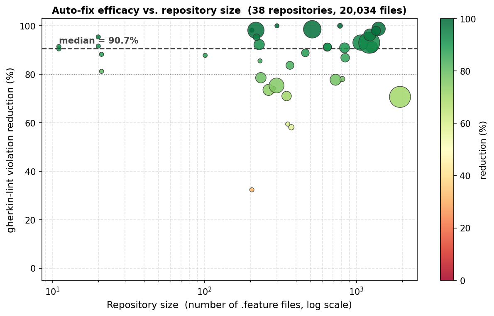
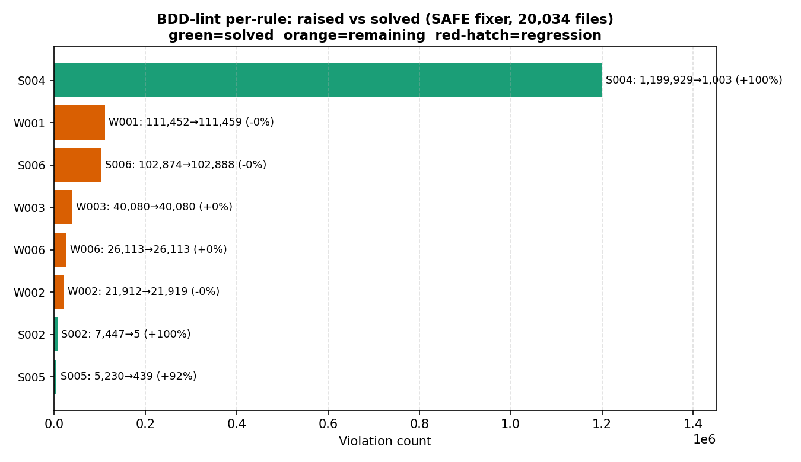

# Evaluation

This document covers how the evaluation corpus was collected, how the tool was
measured, the headline results, a per-linter breakdown, and the per-repository
numbers. Every figure here comes from a single run of the validation harness on
the full corpus.

## How the corpus was collected

The corpus was built with a multi-stage GitHub mining pipeline:

1. Repository URLs were gathered from three independent sources: a global code
   search, a GitHub search tool, and the SEART GitHub Search (GHS) tool.
2. The URLs were normalized and deduplicated.
3. Each candidate was enriched with metadata from the GitHub REST API.
4. An activity gate kept only repositories with at least one star and at least
   one commit.
5. A feature-file count (via the GitHub Trees API) kept repositories that declare
   at least ten `.feature` files.

This left 38 repositories. The evaluation runs over all 20,034 `.feature` files
present in them.

## The evaluation method

The harness runs a per-file loop. For each `.feature` file it:

1. lints the original with all three linters (gherkin-lint, cuke_linter, and the
   native linter) and records their counts (the "before" measurement),
2. applies the form-preserving fixer to a copy of the file,
3. lints the fixed copy with all three linters again (the "after" measurement),
4. writes one row with sixteen columns.

`gherkin-lint` and `cuke_linter` are used as independent oracles. A fix is only
trustworthy when their counts fall or stay the same and never rise. Because the
three linters use different rule sets and counting granularities, their counts
are kept separate and never added together.

## Headline results

On the 20,034 files, with the form-preserving fixer:

- gherkin-lint violations fell 85.6 percent (1,163,482 to 167,902)
- native violations fell 79.8 percent (1,532,486 to 309,024)
- 99.8 percent of files improved, with no regressions
- the median repository saw a 90.7 percent reduction

The per-repository view shows the result is broad-based rather than driven by a
few large projects. Each bubble is one repository; the horizontal axis is its
size, the vertical axis its gherkin-lint reduction, and the bubble size is the
number of violations before fixing.

## Per-linter breakdown

### gherkin-lint, by rule

Indentation dominates and is almost completely resolved. A few rules
(`name-length`, `only-one-when`) actually go up: fixing the structure lets the
linter parse scenarios it had previously skipped, which surfaces latent semantic
problems. These are reported, not fixed.

| Rule | Before | After | Resolved |
| --- | ---: | ---: | ---: |
| indentation | 999,482 | 746 | 998,736 |
| name-length | 53,425 | 70,072 | -16,647 |
| only-one-when | 43,124 | 57,756 | -14,632 |
| keywords-in-logical-order | 26,255 | 26,963 | -708 |
| file-name | 14,603 | 1,169 | 13,434 |
| no-multiple-empty-lines | 8,826 | 1,949 | 6,877 |
| unexpected-error | 4,668 | 4,361 | 307 |
| no-trailing-spaces | 3,726 | 7 | 3,719 |
| scenario-size | 3,719 | 3,766 | -47 |
| no-dupe-scenario-names | 2,706 | 6 | 2,700 |
| new-line-at-eof | 1,569 | 9 | 1,560 |
| no-multiline-steps | 1,103 | 1,017 | 86 |
| no-unnamed-scenarios | 184 | 54 | 130 |
| no-unnamed-features | 34 | 0 | 34 |

### cuke_linter, by class, and why it barely moves (-1.5 percent)

cuke_linter is largely orthogonal to form-preserving fixing. Most of its mass is
semantic rules that the fixer does not target, so its overall movement is small
(302,053 to 297,461, a 1.5 percent reduction). The one fully-resolved class is
`StepWithEndPeriod`, from the trailing-period fix.

The filename rules are the interesting part. Renaming files to kebab-case fixes
`FeatureFileWithMismatchedName` but triggers `FeatureFileWithInvalidName`,
because gherkin-lint wants kebab-case and cuke_linter wants snake_case. The two
conventions cannot both be satisfied.

| cuke_linter class | Before | After | Resolved |
| --- | ---: | ---: | ---: |
| StepWithTooManyCharacters | 149,475 | 148,013 | 1,462 |
| TestWithNoVerificationStep | 42,628 | 40,838 | 1,790 |
| TestWithTooManySteps | 29,677 | 29,702 | -25 |
| TestShouldUseBackground | 20,435 | 20,711 | -276 |
| FeatureWithoutDescription | 9,440 | 9,301 | 139 |
| TestWithNoActionStep | 6,321 | 4,529 | 1,792 |
| ElementWithCommonTags | 5,353 | 5,352 | 1 |
| TestWithBadName | 3,236 | 3,229 | 7 |
| ExampleWithoutName | 2,842 | 1,926 | 916 |
| StepWithEndPeriod | 637 | 0 | 637 |
| other smaller classes | ... | ... | ... |
| Filename rules (file-level) | 21,540 | 23,192 | -1,652 |
| &nbsp;&nbsp;FeatureFileWithMismatchedName | 14,419 | 5,309 | 9,110 |
| &nbsp;&nbsp;FeatureFileWithInvalidName | 7,121 | 17,883 | -10,762 |
| **Total** | **302,053** | **297,461** | **4,592** |

Non-filename cuke rules resolved 6,244 violations. The filename rules went 1,652
worse because of the kebab-versus-snake conflict. Fully resolving the filename
conflict would only move cuke from -1.5 percent to about -2.1 percent, and it
cannot be done without breaking gherkin-lint's requirement. That is the point of
the mutually unsatisfiable conflict.

## Per-repository results (38 repositories)

The median repository sees a 90.7 percent reduction, the minimum is 32.3
percent, and no repository regresses. The aggregate 85.6 percent is weighted by
violation count, so a few very large projects pull it below the median.

| Repository | Files | Before → After | Reduction |
| --- | ---: | --- | ---: |
| [inukshuk/citeproc](https://github.com/inukshuk/citeproc) | 780 | 6,695 → 0 | 100.0% |
| [skgopinath/featuretagselector](https://github.com/skgopinath/featuretagselector) | 300 | 2,100 → 0 | 100.0% |
| [Novus-Engine/novuspack](https://github.com/Novus-Engine/novuspack) | 1,399 | 48,827 → 604 | 98.8% |
| [CriminalInjuriesCompensationAuthority/q-templates-application](https://github.com/CriminalInjuriesCompensationAuthority/q-templates-application) | 512 | 83,413 → 1,192 | 98.6% |
| [bdewey/git-stack](https://github.com/bdewey/git-stack) | 205 | 4,376 → 79 | 98.2% |
| [keygen-sh/keygen-api](https://github.com/keygen-sh/keygen-api) | 218 | 72,291 → 1,340 | 98.1% |
| [git-town/git-town](https://github.com/git-town/git-town) | 1,345 | 22,905 → 470 | 97.9% |
| [HarrisClover/RequireCEG](https://github.com/HarrisClover/RequireCEG) | 1,225 | 39,364 → 1,481 | 96.2% |
| [csu0077/project3_testing](https://github.com/csu0077/project3_testing) | 20 | 762 → 35 | 95.4% |
| [opencypher/openCypher](https://github.com/opencypher/openCypher) | 220 | 12,497 → 591 | 95.3% |
| [projectestac/alexandria](https://github.com/projectestac/alexandria) | 1,064 | 63,910 → 4,421 | 93.1% |
| [reqnroll/Reqnroll.ExploratoryTestProjects](https://github.com/reqnroll/Reqnroll.ExploratoryTestProjects) | 1,214 | 158,090 → 11,044 | 93.0% |
| [Corvusoft/restq](https://github.com/Corvusoft/restq) | 229 | 29,662 → 2,296 | 92.3% |
| [kabisa/books](https://github.com/kabisa/books) | 20 | 705 → 59 | 91.6% |
| [pherkin/test-bdd-cucumber-perl](https://github.com/pherkin/test-bdd-cucumber-perl) | 11 | 363 → 31 | 91.5% |
| [trydirect/sylius](https://github.com/trydirect/sylius) | 646 | 17,085 → 1,490 | 91.3% |
| [cchitsiang/bdd](https://github.com/cchitsiang/bdd) | 1,262 | 36,448 → 3,200 | 91.2% |
| [inventorypapa/free-dropshipping-automation-software](https://github.com/inventorypapa/free-dropshipping-automation-software) | 643 | 18,547 → 1,631 | 91.2% |
| [Sylius/Sylius](https://github.com/Sylius/Sylius) | 835 | 26,992 → 2,452 | 90.9% |
| [iriusrisk/bdd-security](https://github.com/iriusrisk/bdd-security) | 11 | 441 → 42 | 90.5% |
| [SU-SWS/linky_clicky](https://github.com/SU-SWS/linky_clicky) | 461 | 16,120 → 1,803 | 88.8% |
| [maurafitz/coop-workshift-app](https://github.com/maurafitz/coop-workshift-app) | 21 | 832 → 98 | 88.2% |
| [buildingSMART/ifc-gherkin-rules](https://github.com/buildingSMART/ifc-gherkin-rules) | 101 | 1,567 → 191 | 87.8% |
| [ashwanth1109/gherkin-feature-parser](https://github.com/ashwanth1109/gherkin-feature-parser) | 843 | 20,310 → 2,675 | 86.8% |
| [saqibrizvi11/SH2_contactMaps](https://github.com/saqibrizvi11/SH2_contactMaps) | 232 | 1,604 → 232 | 85.5% |
| [rpm-software-management/ci-dnf-stack](https://github.com/rpm-software-management/ci-dnf-stack) | 365 | 17,419 → 2,841 | 83.7% |
| [Rotbarsch/NatLaRestTest](https://github.com/Rotbarsch/NatLaRestTest) | 21 | 367 → 69 | 81.2% |
| [openshift/verification-tests](https://github.com/openshift/verification-tests) | 235 | 29,696 → 6,361 | 78.6% |
| [esg4aspl/SPL-ESG-Examples](https://github.com/esg4aspl/SPL-ESG-Examples) | 807 | 7,352 → 1,614 | 78.0% |
| [learningequality/kolibri](https://github.com/learningequality/kolibri) | 729 | 32,870 → 7,316 | 77.7% |
| [hmcts/ia-ccd-e2e-tests](https://github.com/hmcts/ia-ccd-e2e-tests) | 298 | 60,043 → 14,791 | 75.4% |
| [SoftEng-UniGE/BEWT-Specifications](https://github.com/SoftEng-UniGE/BEWT-Specifications) | 284 | 2,807 → 725 | 74.2% |
| [actiontech/dble-test-suite](https://github.com/actiontech/dble-test-suite) | 264 | 33,735 → 8,921 | 73.6% |
| [vanderbilt-redcap/redcap_rsvc](https://github.com/vanderbilt-redcap/redcap_rsvc) | 347 | 24,457 → 7,085 | 71.0% |
| [local-web-services/local-web-services](https://github.com/local-web-services/local-web-services) | 1,936 | 256,831 → 75,329 | 70.7% |
| [Sahamati/certification-framework](https://github.com/Sahamati/certification-framework) | 353 | 2,489 → 1,009 | 59.5% |
| [BRP-API/Haal-Centraal-BRP-bevragen](https://github.com/BRP-API/Haal-Centraal-BRP-bevragen) | 373 | 7,951 → 3,329 | 58.1% |
| [bcgov/onRouteBCSpecification](https://github.com/bcgov/onRouteBCSpecification) | 205 | 1,559 → 1,055 | 32.3% |

## Command-line parameters

| Parameter | Tool | Description | Default |
| --- | --- | --- | --- |
| `path` | linter, fixer | feature file or directory | required |
| `--format` | linter | output `text` or `json` | `text` |
| `--severity` | linter | minimum severity reported | all |
| `--summary` | linter | print counts only | off |
| `--no-style`, `--no-workflow` | `cli.py` | disable a rule family | off |
| `-o`, `--output` | fixer | output directory | `fixed_features/` |
| `--dry-run` | fixer | preview, no writes | off |
| `--no-indentation`, `--no-spacing`, `--no-periods` | fixer | skip a fix class | off |
| `-r`, `--repos-root` | harness | corpus directory | required |
| `-w`, `--workers` | harness | parallel workers | 1 |
| `-n`, `--sample` | harness | sample N files | all |

## A note on these numbers

These results come from one corpus of 38 repositories. The reductions depend on
the starting quality of the `.feature` files, which varies a lot from project to
project, so the numbers on a different corpus will differ. The figures here are
meant to characterize the tool on real-world code, not to promise a fixed
percentage on any given repository.
